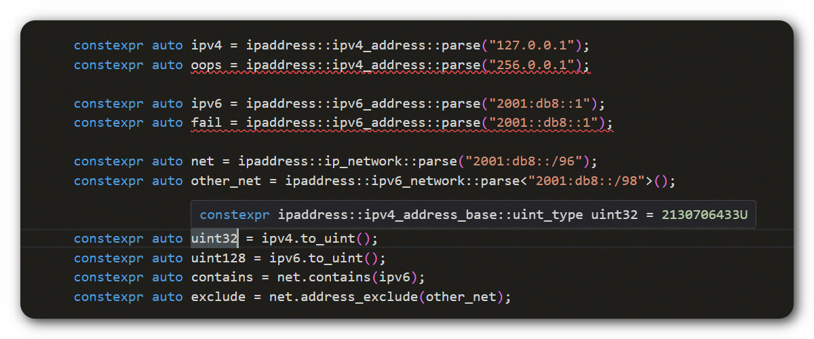

# ipaddress

[](https://github.com/VladimirShaleev/ipaddress/releases)
[](https://github.com/VladimirShaleev/ipaddress/blob/main/LICENSE)
[
](https://github.com/VladimirShaleev/ipaddress/actions/workflows/tests.yml)

A library for working and manipulating IPv4/IPv6 addresses and networks in modern C++.

## Introduction

This cross-platfrom **header-only** library (for C++11 and newer) is inspired by the [ipaddress API in Python](https://docs.python.org/3.12/library/ipaddress.html), 
from which it derives its name. It aims to be simpler to use due to its familiar interface. However, the C++ implementation takes 
a different approach: it uses **static polymorphism** through the strategy pattern instead of dynamic polymorphism to handle 
differences between IP versions (IPv4 and IPv6). This design choice eliminates the overhead of dynamic calls and virtual tables. 
For instance, an instance of the **ipv4_address** class will be represented by 4 bytes.

The library leverages modern C++ features, ensuring that all IP address and network operations support constant expressions. 



## Compatibility

The library has been tested on the following compilers:

* Clang 6.0.1 and newer;
* Apple Clang 13.0.0 and newer;
* GCC 7.5.0 and newer;
* MSVC 14.29 (Visual Studio 16.11) and newer

## Installation

You can install in one of the following ways

### Use package managers

#### Vcpkg

*The package has not yet been published*

#### Conan

*The package has not yet been published*

#### Ubuntu PPA

```bash
sudo add-apt-repository ppa:vladimirshaleev/ipaddress
sudo apt update

sudo apt install libipaddress-dev
```

Then, if you use **CMake** for build, you need to link the target (**regardless of how you installed the package**):

```cmake
cmake_minimum_required(VERSION 3.8.0)

project(my_project LANGUAGES CXX)

find_package(ipaddress CONFIG REQUIRED)

add_executable(my_project main.cpp)
target_link_libraries(my_project ipaddress::ipaddress) # add the library to your target
```

### Use as a Submodule with CMake

Go to your project directory and add a submodule:

```bash
cd my_project
git submodule add https://github.com/VladimirShaleev/ipaddress.git third-party/ipaddress/
```
then in the CMake project add it to the directory:

```cmake
cmake_minimum_required(VERSION 3.8.0)

project(my_project LANGUAGES CXX)

add_subdirectory(third-party/ipaddress)

add_executable(my_project main.cpp)
target_link_libraries(my_project ipaddress::ipaddress) # add the library to your target
```

### Use CMake FetchContent

```cmake
cmake_minimum_required(VERSION 3.8.0)

project(my_project LANGUAGES CXX)

include(FetchContent)
FetchContent_Declare(
  ipaddress
  GIT_REPOSITORY https://github.com/VladimirShaleev/ipaddress
  GIT_TAG v1.0.1
)
FetchContent_MakeAvailable(ipaddress)

add_executable(my_project main.cpp)
target_link_libraries(my_project ipaddress::ipaddress) # add the library to your target
```

## Quick Start

The library provides capabilities for creating, analyzing and managing IPv4 and IPv6 addresses and networks using classes such 
as **ipv4_address**, **ipv6_address**, **ip_address** (any IP version), **ipv4_network**, **ipv6_network** and **ip_network** 
(any IP version). It also offers error handling methods with or without exceptions if for some reason exceptions are not used 
or disabled in your project.

To start using the library, simply include the header `ipaddress/ipaddress.hpp`, and you’re ready to begin your work!

Here is an example demonstrating some of the library's features (this example can be compiled with C++14 or higher):

```cpp
#include <iostream>

#include <ipaddress/ipaddress.hpp>

using namespace ipaddress;

void parse_ip_sample() {
    constexpr auto ip = ipv6_address::parse("fec0::1ff:fe23:4567:890a%eth2");
    constexpr auto is_site_local = ip.is_site_local();

    std::cout << "ip " << ip << " is local: " << std::boolalpha << is_site_local << std::endl;
    std::cout << "DNS PTR " << ip.reverse_pointer() << std::endl << std::endl;
}

void teredo_sample() {
    constexpr auto teredo_ip = "2001:0000:4136:e378:8000:63bf:3fff:fdd2"_ipv6;
    auto [server, client] = teredo_ip.teredo().value();

    std::cout << "server: " << server << " and client: " << client << " for " << teredo_ip << std::endl << std::endl;
}

void subnets_sample() {
    constexpr auto net = ipv4_network::parse("192.0.2.0/24");

    std::cout << "subnets for " << net << ':' << std::endl;
    for (const auto& subnet : net.subnets(2)) {
        std::cout << "  " << subnet << std::endl;
    }

    constexpr auto last_subnet = net.subnets(2).back();
    std::cout << "last subnet " << last_subnet << std::endl;
}

int main() {
    parse_ip_sample();
    teredo_sample();
    subnets_sample();
    return 0;
}
```

## Documentation

For more details on setup, usage and code examples can be found in the full [documentation](https://vladimirshaleev.github.io/ipaddress/).
